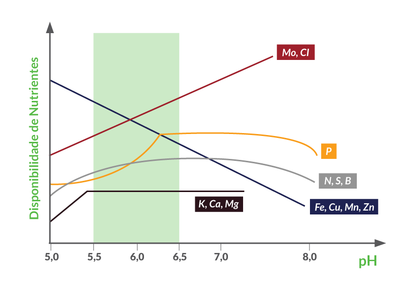
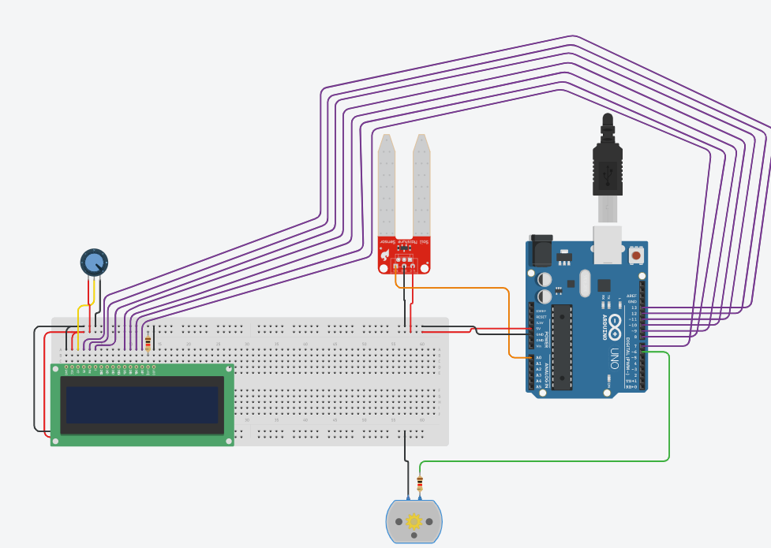

# Global Solution Kraft Heinz - Edge Computing & Computer Systems

Bem-vindo(a) ao projeto de Monitoramento de pH do Solo e Neutralizador Automático! Este repositório contém todos os arquivos necessários para implementar um sistema baseado em Arduino que monitora o pH do solo e libera automaticamente um neutralizador, garantindo um ambiente ideal para o crescimento saudável de plantas.

## Detalhes do Projeto

Dado o problema em relação a fome e escassez de alimentos, nosso grupo desenvolveu o AgroSense, que visa fazer o sensoriamento do pH do solo nas plantações. Ao detectar um desequilíbrio no pH, o sistema aciona com um motor a solução neutralizadora para ajustar o nível de acidez ou alcalinidade, garantindo que o solo esteja nas condições ideais para o cultivo. Como nosso intuito é utilizar um sensor de pH e a biblioteca do tinkercad não possui, simulamos com o sensor de umidade do solo.

## Requisitos para 1 Protótipo

- 1 Arduíno R3
- 1 Display LCD 16x2
- 1 Potenciômetro
- 1 Motor CC
- 2 Resistores
- 20 Cabos macho-macho
- 1 Sensor de pH do solo

## Instruções de Configuração e Instalação

Para utilizar o AgroSense, será necessário:
- Conectar o sensor de pH ao Arduíno de acordo com o esquema de pinos da imagem acima. 
- Conectar o Display com o potenciômetro nas portas corretas
- Ligar o motor na porta digital correta do Arduíno.
- Fazer o upload do código fonte disponibilizado.
- Conectar o Arduíno num computador que possua a IDE do Arduíno e fazer o teste com o código fonte.

## Uso e Funcionamento

- Posicione o sensor de pH do solo no solo que deseja monitorar.
- Ligue o Arduino.
- O sensor de pH realizará leituras periódicas e enviará os dados para o Arduino.
- O Arduino analisará os dados e comparará com os valores de pH pré-estabelecidos como ideais.
- Caso o pH do solo esteja fora do intervalo desejado, o Arduino acionará o neutralizador.
- O neutralizador será liberado e ajustará o pH do solo automaticamente.
- O sistema continuará monitorando o pH do solo e agindo conforme necessário para manter o equilíbrio adequado.

A leitura será enviada para um app, onde trará informações a respeito da saúde em tempo real do solo incluindo dados sobre a neutralização.

## Contribuição

Esperamos que este projeto seja útil e inspire outros a explorar a automação na agricultura. Acreditamos que a tecnologia pode desempenhar um papel importante na melhoria da produtividade e sustentabilidade do setor agrícola.

 Nosso intuito com o projeto é fazer com que as empresas e proprietários de plantações de alimentos tenham menos prejuízos em relação aos alimentos plantados que crescem sem nutrientes suficientes devido à alteração de pH do solo, prejudicado principalmente pelo uso intensivo de agrotóxicos. Consequentemente, gerando alimentos de maior quantidade nutricional e mantendo o solo fértil por mais tempo, aumentando assim a produtividade a longo prazo, ajudando assim a amenizar problemas como a fome e a escassez de alimentos.

## Integrantes

- João Lucas Cancado Pamponet - rm 551612
- Murilo Marsola Eloys - rm 552117
- Pedro Pereira dos Santos - rm 552047
- Ricardo Ramos Vergani - rm 550166
- Victor Kenzo Toma - rm 551649
